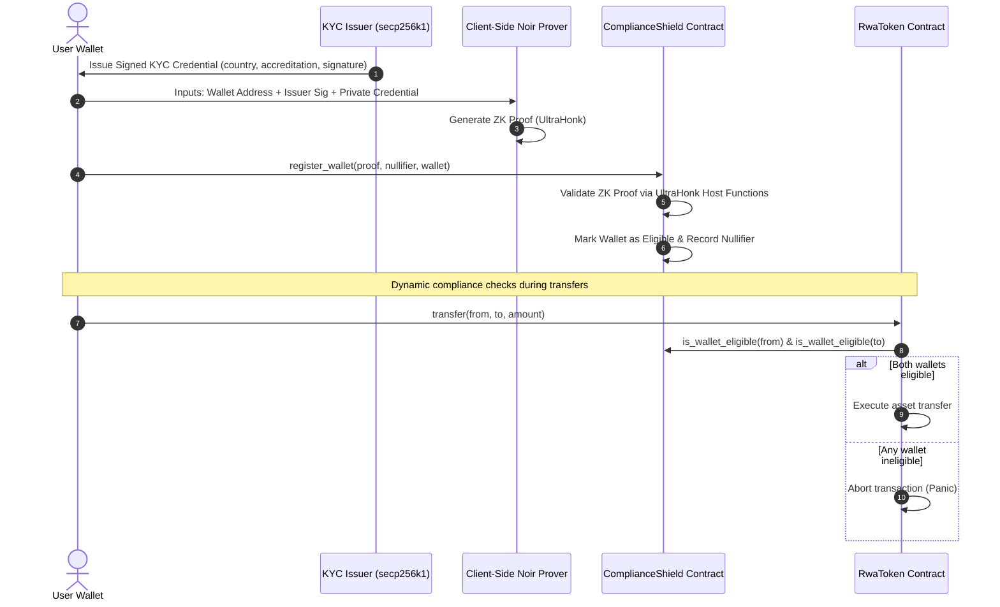

# Narthex: ZK-SEP-57 Compliance Shield on Soroban

[](https://opensource.org/licenses/MIT)
[](https://stellar.org)
[](https://noir-lang.org)
[](https://narthex-eta.vercel.app/)

**Narthex** is an institutional-grade implementation of the **ZK-SEP-57 Compliance Shield** on the Stellar Soroban smart contract platform. It enables real-world asset (RWA) token issuers to enforce strict regulatory compliance (KYC, AML, accreditation status, and country-of-origin restrictions) without compromising user privacy or disclosing sensitive user data on a public ledger.

---

## 📖 The Problem & The ZK Solution

### The Friction
Stellar is the leading network for real-world asset tokenization (real estate, stablecoins, treasuries). However, regulatory frameworks require token issuers to ensure all participants are fully KYC-verified and not resident in sanctioned countries.
* **Traditional Approach**: Every transaction checks a public whitelist or registers user credentials on-chain. This exposes user identities, countries, and investment statuses to the public.
* **The ZK-SEP-57 Approach**: Users generate a Zero-Knowledge Proof off-chain. The proof verifies that they possess a valid KYC credential signed by an authorized issuer and do *not* reside in any banned country. The proof is verified on-chain, registering their wallet as eligible without revealing *any* private data.

---

## 🛠️ System Architecture



---

## 🧬 Zero-Knowledge Circuit (Noir)

The ZK circuit is written in [NoirLang](https://noir-lang.org) and compiles into an **UltraHonk** proof. The circuit verifies the following constraints:

### 1. Circuit Inputs
* **Private Inputs**:
  - `user_pubkey_x`, `user_pubkey_y`: User's public key coordinates.
  - `user_signature`: secp256k1 signature over the target wallet hash, proving wallet ownership.
  - `issuer_signature`: secp256k1 signature of the KYC Issuer over the credential payload.
  - `issuer_pub_key_x`, `issuer_pub_key_y`: Issuer's public key coordinates.
  - `country_code`: User's country code (ISO numeric).
  - `is_accredited`: User's accreditation status.
  - `secret_salt`: Random salt values protecting user privacy.
* **Public Inputs**:
  - `target_wallet_hash`: Blake2s hash of the serialized Stellar address.
  - `banned_countries`: Array of 5 banned country codes.

### 2. Verified Rules
1. **Wallet Control**: Verifies that the user controls the private key associated with the target wallet address.
2. **Credential Authenticity**: Verifies that the credential (associated public key, country code, accreditation) was signed by the authorized KYC Issuer.
3. **Exclusion Check**: Verifies that the `country_code` is *not* present in the list of `banned_countries`.
4. **Nullifier Generation**: Outputs a unique `nullifier = Blake2s(user_pubkey, secret_salt)` to prevent double registration.

---

## 💻 Smart Contract Structure (Soroban)

The project consists of two core Soroban smart contracts:

1. **`compliance-shield`** ([contracts/compliance-shield](file:///c:/Users/Admin/Desktop/Narthex/contracts/compliance-shield/src/lib.rs)):
   - Verifies the ZK UltraHonk proof using Stellar's native Protocol 25/26 BN254 host functions via the `rs-soroban-ultrahonk` verifier.
   - Restricts duplicate registrations using the proof nullifier.
   - Manages the list of 5 banned country IDs.
2. **`rwa-token`** ([contracts/rwa-token](file:///c:/Users/Admin/Desktop/Narthex/contracts/rwa-token/src/lib.rs)):
   - Represents a regulated real-world asset ledger.
   - Queries the `ComplianceShield` contract dynamically during `mint` and `transfer` calls to verify that the sender and receiver are compliant.

---

## 🚀 Getting Started

### Prerequisites
* [Node.js](https://nodejs.org) (v18+)
* Rust & Cargo (with target `wasm32-unknown-unknown`)
* Soroban CLI

### Installation
1. Clone the repository:
   ```bash
   git clone https://github.com/angelraph/Narthex.git
   cd Narthex
   ```
2. Install npm dependencies:
   ```bash
   npm install
   ```

### Compile and Build
1. **Compile ZK Circuits**:
   ```bash
   npm run compile
   ```
2. **Build Soroban Contracts**:
   ```bash
   cd contracts
   cargo build --target wasm32-unknown-unknown --release
   ```

### Deploy to Testnet
You can deploy the compiled contracts directly to the Stellar Testnet:
```bash
node scripts/deploy.js
```
> [!TIP]
> **Zero Configuration:** If no `STELLAR_SECRET_KEY` is provided, the script will automatically generate a new keypair, fund it via the Friendbot faucet, and deploy the contracts using the funded account!

---

## 📹 Hackathon Demo Video Script
For recording your submission walkthrough, refer to the complete presenter script and timeline outline in [video_script.md](file:///c:/Users/Admin/Desktop/Narthex/video_script.md).

---

## 🌐 Live Visualizer Dashboard
We host a fully interactive demo dashboard where you can simulate the entire compliance lifecycle:
* **URL**: [https://narthex-eta.vercel.app/](https://narthex-eta.vercel.app/)

Features of the dashboard:
1. **Issuer Portal**: Automatically generates mock keypairs and signs credentials for test users.
2. **User Portal**: Renders a live ZK-Prover terminal showing step-by-step constraint verification and computes the actual Blake2s wallet hash.
3. **Asset Ledger**: Simulates the RWA token transfer ledger, demonstrating that non-eligible wallets are blocked dynamically by the compliance shield.

